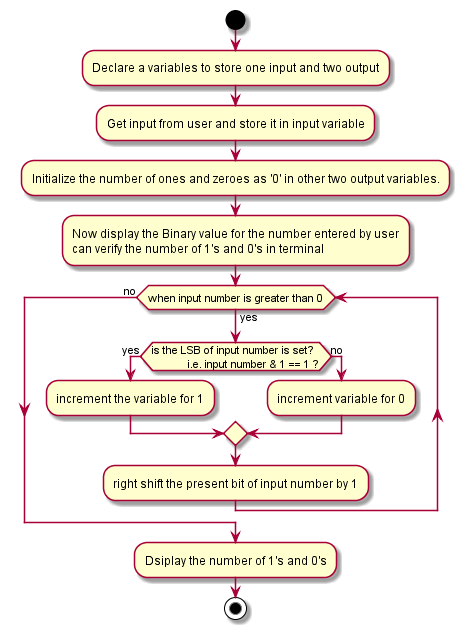

# count zeros and ones in a binary number:
To create a program which is used to find the number of binary ones and binary zeroes in a given decimal numbers.
# Working:
- In this program,we are reading the decimal number using  variable.
- A decimal number system is a base number system using digits.
- Check whether the number is less than or equal to zero.
- Divide the number and store the remainder.
- And it Increase the length.
- After the execution of loop.
## Following flow chat for the task:
 
 - version:

    binary-zeroes-and-ones-of-decimal-numbers Version-v1.0.0